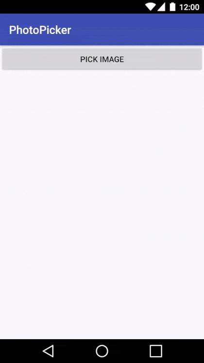

# Photo Picker

A simple to use and very light weight Photo Picker written to reduce the boilerplate, supports `Camera` (all available Camera intents) and `ACTION_GET_CONTENT` on pre-KitKat (API 19) Android versions and `ACTION_OPEN_DOCUMENT` on newer versions.



## Features

* Supports maximum `width` and `height` 
* Supports quality (`default 70%`)
* Customizable picker `title`
* Normalize rotation

## Important
This picker does not require `CAMERA` permission in `AndroidManifest`, in case an app does have `CAMERA` permission in manifest, the picker will check if the permission was already given, if not, it will request `CAMERA` permission

## Installation

```
dependencies {
    implementation 'net.mready.picker:photopicker:1.0.2'
}
```

## Usage

The simplest way to use PhotoPicker is to create an `Intent` using `PhotoPicker.Builder`

```java
final int size = (int) TypedValue.applyDimension(TypedValue.COMPLEX_UNIT_DIP, 96, getResources().getDisplayMetrics());

Intent photoPickerIntent = new PhotoPicker.Builder(getApplicationContext())
                        .maxHeight(size * 3)
                        .maxWidth(size * 3)
                        .title(R.string.take_picture)
                        .quality(80)
                        .build();

```
and then call `startActivityForResult` using the intent returned by the builder.

```java
startActivityForResult(photoPickerIntent, REQ_CODE);
```

## Dependencies

This library depends on `support-v4` for easily checking and requesting permissions (if needed).

## License

```
Copyright 2017 mReady

Licensed under the Apache License, Version 2.0 (the "License");
you may not use this file except in compliance with the License.
You may obtain a copy of the License at

   http://www.apache.org/licenses/LICENSE-2.0

Unless required by applicable law or agreed to in writing, software
distributed under the License is distributed on an "AS IS" BASIS,
WITHOUT WARRANTIES OR CONDITIONS OF ANY KIND, either express or implied.
See the License for the specific language governing permissions and
limitations under the License.
```
